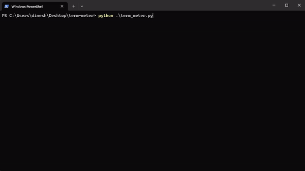

# TermMeter



Author: **Prashant Bhandari**

`TermMeter` is a Python class designed to create a text-based progress meter for tracking the progress of a task in the terminal. It inherits from a class called [``TextArtisan``](https://github.com/prashantbhandari128/text-artisan), which includes methods for formatting text in the terminal.

## Class Documentation

### Attributes

- `title`: str
  - Title of the progress meter.
- `total`: int
  - Total number of steps for the task.
- `width`: int (default: 50)
  - Width of the progress bar.
- `eta`: bool (default: True)
  - Whether to display estimated time remaining.
- `benchmark`: bool (default: False)
  - Whether to display benchmark information.

### Methods

#### `__init__(self, title, total, width=50, eta=True, benchmark=False)`

Initialize the `TermMeter` object.

Parameters:
- `title`: str
  - Title of the progress meter.
- `total`: int
  - Total number of steps for the task.
- `width`: int, optional (default: 50)
  - Width of the progress bar.
- `eta`: bool, optional (default: True)
  - Whether to display estimated time remaining.
- `benchmark`: bool, optional (default: False)
  - Whether to display benchmark information.

#### `start()`

Start the progress meter by recording the start time.

#### `update(self, progress)`

Update the progress meter with the current progress.

Parameters:
- `progress`: int
  - Current progress value.

#### `pause()`

Pause the progress meter by recording the pause time.

#### `resume()`

Resume the progress meter by adjusting the start time based on the pause duration.

#### `reset()`

Reset the progress meter by clearing the start time and progress.

#### `is_complete()`

Check if the progress meter has reached completion.

Returns:
- `bool`: True if progress is equal to total, False otherwise.

#### `elapsed_time()`

Calculate the elapsed time since the progress meter started.

Returns:
- `float`: Elapsed time in seconds.

#### `remaining_time()`

Calculate the estimated time remaining based on current progress.

Returns:
- `float`: Estimated time remaining in seconds.

#### `get_benchmark_info(progress)`

Get benchmark information.

Parameters:
- `progress`: int
  - Current progress value.

Returns:
- `dict`: A dictionary containing the progress ratio, elapsed time, and remaining time.

#### `calculate_eta(progress)`

Calculate the estimated time remaining.

Parameters:
- `progress`: int
  - Current progress value.

Returns:
- `dict`: A dictionary containing the estimated time remaining in seconds, minutes, and hours.

## Installation

No additional installation steps are necessary. Simply include the ``term_meter.py`` and ``text_artisan.py`` file in your project.

## Usage

Here's a simple example demonstrating how to use `TermMeter`:

### Code:
```python
from termmeter.term_meter import TermMeter
import time

# Initialize TermMeter for tracking progress
processing_meter = TermMeter("Processing", total=50, width=50, benchmark=True)

# Start the progress meter
processing_meter.start()

# Simulate task execution
for i in range(1, 50):
    # Do some processing here...
    if i == 25:  # Pause processing_meter in the middle of progress.
        processing_meter.pause()
        time.sleep(0.45)  # Simulate some other activity.
        processing_meter.resume()
    time.sleep(0.1)
    # Update progress
    processing_meter.update(i + 1)
```